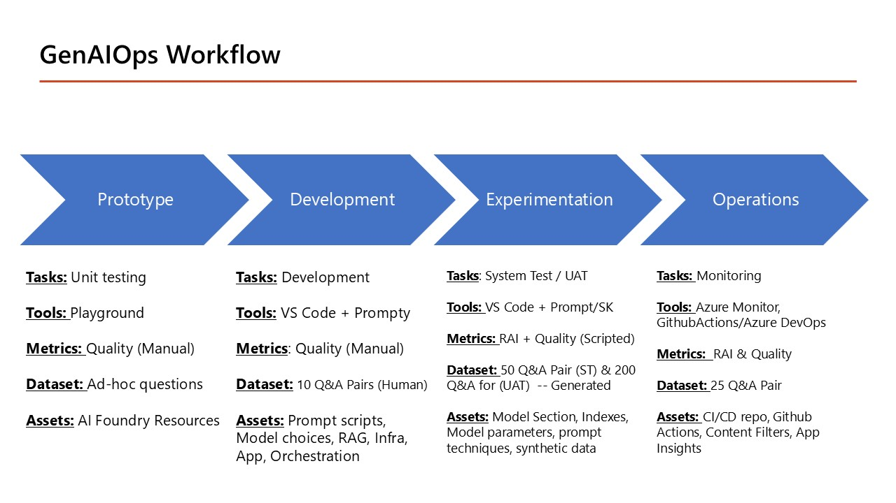

# GenAIOps Playbook
GenAIOps playbook of crowd-source materials to deploy your Gen AI apps to production

We are thrilled to share the best tools, guides, and insights on GenAIOps from our vibrant developer community. We hope that this blog can become your go-to playbook for mastering GenAIOps, offering a comprehensive workflow that you can leverage for seamless production deployments. We love to crowd-source this playbook and encourage you to share your top resources and suggestions via pull requests.  As a community, we can share our best practices, lessons learned and learing resources to build the future of Generative AI applications together.  In today's world, it is not the technology that is the most challenging rather the process and this is the key blocker we hope to overcome.

There will be four phases: Prototype, Development, Experimentation/Testing and Operations.  Here is a digram of this conceptual model and will leverage it as a Table of contents for developers.  This is not an industry or Microsoft standard for GenAIOps.

## Diagram

## Table of Contents

| **Prototype** |  **Development**  | **Experimentation** |  **Operations**  |
|---------------|-------------------|---------------------|------------------|
| [Business Use Case](./Playbook/1_Prototype/README.md) | [Gen AI Patterns](./Playbook/2_Development/README.md) | [Test Case Development](./Playbook/3_Experimentation/README.md) | [CI/CD](./Playbook/4_Operations/README.md)|
| [Model Benchmarks](./Playbook/1_Prototype/README.md) | [Prompt Engineering](./Playbook/2_Development/README.md)|[System Testing](./Playbook/3_Experimentation/README.md) | [Monitoring](./Playbook/4_Operations/README.md) |
| [Prompt Playground/Unit Testing](./Playbook/1_Prototype/README.md) | [RAG](./Playbook/2_Development/README.md) | [UAT Testing](./Playbook/3_Experimentation/README.md) | [Deployment Review Board](./Playbook/4_Operations/README.md) |
| [Impact Assessment](./Playbook/1_Prototype/README.md) (Responsible AI) | [Fine-tuning](./Playbook/2_Development/README.md) || [Blue-Green Deployments](./Playbook/4_Operations/README.md)|
|  | [Orchestration](./Playbook/2_Development/README.md) | ||
|  | [Application](./Playbook/2_Development/README.md) | ||

## DevOps Lifecycles
Before we dive in, let's define different DevOps lifecycles to help differentiate this one and integrate it into your existing workflows:

1.  <u>**DevOps**</u>: A set of practices that combines software development and IT operations to shorten the system development lifecycle and provide continuous delivery with high software quality.
2.  <u>**DataOps**</u>: A collaborative data management practice aimed at improving communication, integration, and automation of data flows between data managers and data consumers within an enterprise.
3.  <u>**MLOps**</u>: A set of practices that aim to deploy and maintain machine learning models in production reliably and efficiently.
4.  <u>**LLMOps**</u>: Specialized practices and workflows designed to streamline the development, deployment, and management of Large Language Models (LLMs) throughout their lifecycle.
5.  <u>**GenAIOps**</u>: A comprehensive set of practices, tools, and frameworks designed to manage the lifecycle of generative AI applications.

I've spent some time reflecting on and debating the difference between LLMOps and GenAIOps. Microsoft recently updated their literature to include GenAIOps workflows, a change from its past terminology of LLMOps. The difference here is subtle but important. There are two workflows: one for building Large Language Models (Foundation Models) and another for applications that use LLMs for inference to support their user community. This blog will focus on the latter.

The GenAIOps model contains all the necessary steps for building Generative AI applications. There are many more references for advanced topics like GraphRAG, multimodal, or Distillation, which will be covered in future blogs as they become more widely adopted and standardized. This workflow is the most common for building "Chat with your data" (Chatbot) applications.

## Contributors
A special thanks to these Cloud advocates who really accelerate our AI Innovations.  Pamela Fox, Nitya Narasimhan, Marlene Mhangami, Facundo Santiago, Farzad Sunavala, Cassie Breviu, Cedric Vidal, Dan Taylor, Rob Chambers, Meera Kuurup, Reza Bonyadi, Jennifer Marsman, Seth Juarez, Priya Vergadia, Apurva Mody, John Alexander, Casey Doyle, Govind Kamtamneni, Piyush Jain, Deepsha Menghani, Shimin Zhang, Paulo Lacerda and Lino Tadros.